# AN ELECTRIC SHOCKER DEVICE FOR SELF DEFENSE

Electric shock weapons are a solution for non lethal self defense. 

$${\color{red}*Security Warning*}$$ 

$${\color{red}Be careful, submitting somebody to an electric shock maybe very dangerous. }$$ 

$${\color{red}The device is given here under the **full responsibility** of people who will use it. }$$ 

$${\color{red}Before use it, you must inquire about the law relating to such a device in your country. }$$ 

$${\color{red}The author cannot, under any circumstances, be held responsible for the use you will make of it.}$$  

This project involves the design and the creation of a DIY portable device that can deliver a strong electrical shock for self defense purposes. 

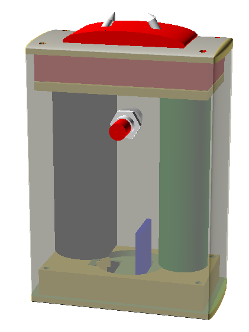
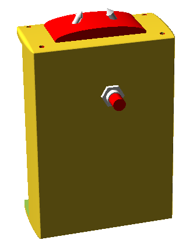
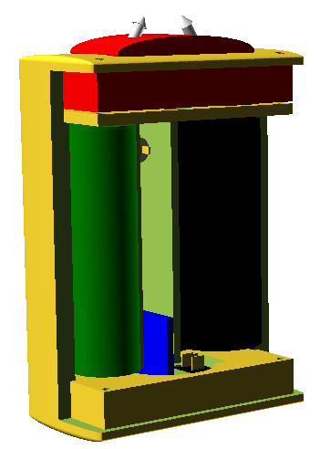

**3D representation of the device** 

## Description

The device is based on four main common electronic components that can easily be found on online sales sites as follow:

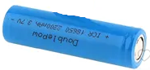

a rechargeable 18650 Lithium-Ion battery, 3.7V, 2200mAh

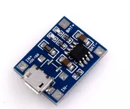
a battery charging circuit

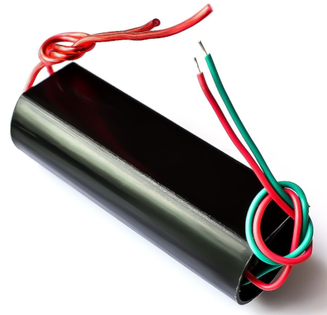

a DC 3V-6V bis 400kV Boost Step up Power Module High Voltage Generator

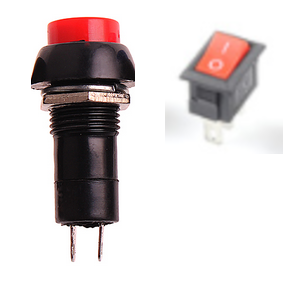

on/off switch and an activation button.

The above components are organized into an housing case compozed of 4 parts :

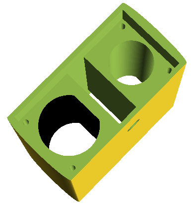

the main body containning the battery, the high voltage module and the flash button. The size of the presented model is 62.9 mm x 32.5 mm x 92 mm

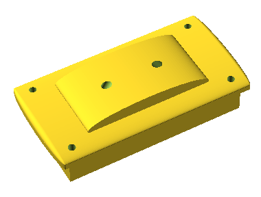

the cover supporting the electrodes on which the high voltage will be applied

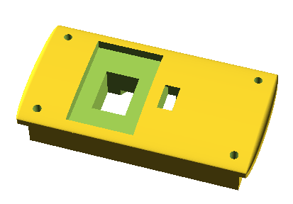

the bottom cover supporting the ON/OFF switch and the usb battery charger

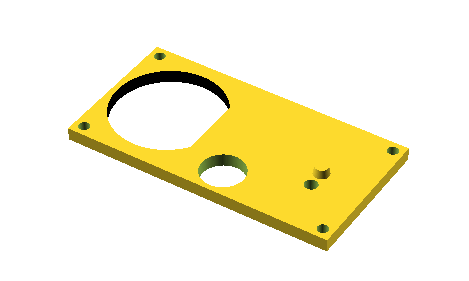

a spacer. 

## Mechanical design

The device is designed as a full parametric 3D model under [OpenSCAD](https://openscad.org).

You can use, as it, or tune the model by adjusting the dimensions of various elements (default value parameters of these elements are specified below):

- **the electrodes**
	- electrode_diam=3;
	- electrode_spacing=12;
	- electrode_angle=60;
	- electrode_length = 11;
	- electrode_shift = 20;
- **the battery**
	- battery_length=67;
	- battery_diam=18.4;
- **the high voltage module**
	- hv_length=63;
	- hv_diam=24.5;
- **the battery contact (Upholsterer's point)**
	- battery_contact_diam = 4;
	- battery_contact_height=4;
- **the usb charger**
	- charger_dim =[17,2, 28];
- **the common mechanical clearance between elements**
	- clearance = 0.2;    
- **the high lid**
	- high_lid_inclusion = 10;
- **the low lid**
	- low_lid_inclusion = 10;
- **the spacer**
	- high_spacer_height = 3;
- **the main body** 
	- package_thickness = 4;
	- package_int_size = [hv_diam+battery_diam+5*package_thickness, 
						hv_diam+2*package_thickness, 
						battery_length+high_lid_inclusion+low_lid_inclusion+high_spacer_height+2];
	- package_boss_diam = 5; 
- **positions inside the main body**
	- battery_X_pos = package_int_size[X_axis]/2-package_thickness/2-battery_diam/2;
	- hv_X_pos = -package_int_size[X_axis]/2+package_thickness/2+hv_diam/2;
	- charger_X_pos = 5;
 
## Electrical design

The electrical design includes the integration of all components and the implementation of safety features to prevent accidental discharge. 

..... todo 

## Conclusion

The goal of this project is to create a practical and easy-to-use self defense tool that can provide a strong electrical shock to an attacker.

     
